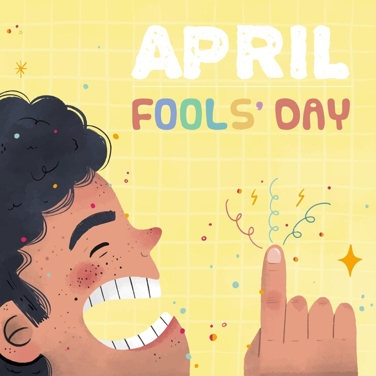

<html>
<head>
    
</head>
<body>

    <h1 id="popup-title">Get your FREE Coffee Here</h1> <!-- Title above the "Click me!" button -->
    <!-- HTML to trigger the pop-up -->
    <button id="click-me" onclick="openPopup()">Click me!</button>
    <!-- Image above the pop-up -->
    
    <!-- The Pop-up -->
    

        <!-- Pop-up content -->
        
Haha..You just got pranked 

        
Happy April Fools' Day Everyone!😜

        <!-- Button to close the pop-up -->
        <button onclick="closePopup()">Close</button>
    

</body>
</html>
